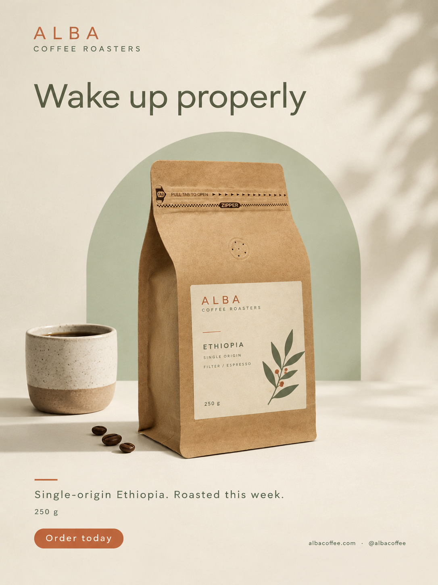

# The Ultimate Ad (Poster) Prompts

A collection of **mega-prompts** to turn a photo of your product into a professional advertising poster using AI image generators: **Google Flow, ChatGPT (image generation), Gemini, Midjourney, Leonardo, Ideogram, Firefly, Copilot Designer**, and any other image-capable AI.

Each prompt is a long, detailed, copy-and-paste block. You attach your product photo as a reference image, paste the prompt, replace everything in `[BRACKETS]` with your own preferences, and generate.

## Example result



**Prompt used:** [`templates/minimalist-product.md`](templates/minimalist-product.md) (Mega-Prompt: Minimalist Product Poster).

**Brief used (all `[BRACKETS]` replaced with real preferences):**

| Field | Value |
|---|---|
| Brand | Alba Coffee Roasters |
| Product | Matte kraft-paper coffee bag, 250 g, cream label |
| Goal | Sell / announce the new single-origin harvest |
| Headline | "Wake up properly" |
| Subheadline | "Single-origin Ethiopia. Roasted this week." |
| Call to action | "Order today" |
| Colors | Warm cream, soft sage green, accent terracotta |
| Format | 3:4 vertical |
| Reference photo | Photo of the coffee bag, attached as a reference image |

> The brand and texts in this example are fictional and were only used to test the prompt.

## How it works (3 steps)

1. **Choose the prompt** that matches your ad from [`templates/`](templates/), or use the generic [`PROMPT_MASTER.md`](PROMPT_MASTER.md) if none fits.
2. **Copy the whole code block**, paste it into your AI and **replace every `[BRACKET]`** with your own details (brand, headline, offer, colors, contact, format...).
3. **Attach your product photo as a reference image** and generate. Then iterate with the follow-up prompts at the end of each file.

> **Important:** every `[BRACKET]` in any prompt of this repo is a placeholder. Always replace it with your own preferences before sending the prompt. If a bracket does not apply to you, delete that line.

## Repo structure

```
.
├── PROMPT_MASTER.md        # Generic mega-prompt (works for any product)
├── example_result.png      # Example poster made with templates/minimalist-product.md
├── templates/              # Ready-to-paste mega-prompts by ad type
│   ├── minimalist-product.md
│   ├── sale-discount.md
│   ├── event.md
│   ├── food-restaurant.md
│   ├── fashion-lifestyle.md
│   ├── tech-gadget.md
│   ├── real-estate.md
│   └── local-business.md
├── guides/
│   ├── prepare-your-photo.md
│   └── common-mistakes.md
└── LICENSE
```

## What every prompt includes

16 detailed sections: reference-photo rules, brief, exact text to render, style and concept, background, props, lighting, camera, color palette, typography, composition and layout, mood, extra details, technical specs, negative instructions and delivery. Each file also ships with follow-up prompts to fix text, protect the product, change format, change palette and more.

## Where to use them

| Tool | How to attach the photo |
|---|---|
| Google Flow | Add the photo as an ingredient / reference image, then paste the prompt |
| ChatGPT | Upload the photo in the chat, paste the prompt, ask it to generate the image |
| Gemini | Upload the photo, paste the prompt |
| Midjourney | Upload the photo, use its URL as an image reference and paste the prompt after it |
| Leonardo / Ideogram / Firefly | Use the image-guidance or reference feature and paste the prompt |

## Tips

- Image models can still misspell text. Keep headlines short and use the **FIX THE TEXT** follow-up if needed.
- If the AI alters your product, use the **PROTECT THE PRODUCT** follow-up.
- Some tools limit prompt length. See [`guides/common-mistakes.md`](guides/common-mistakes.md) for how to shorten it.

## Contributing

New prompts are welcome. Copy any file in `templates/`, keep the same sections and open a pull request.

## License

MIT. See [LICENSE](LICENSE).
